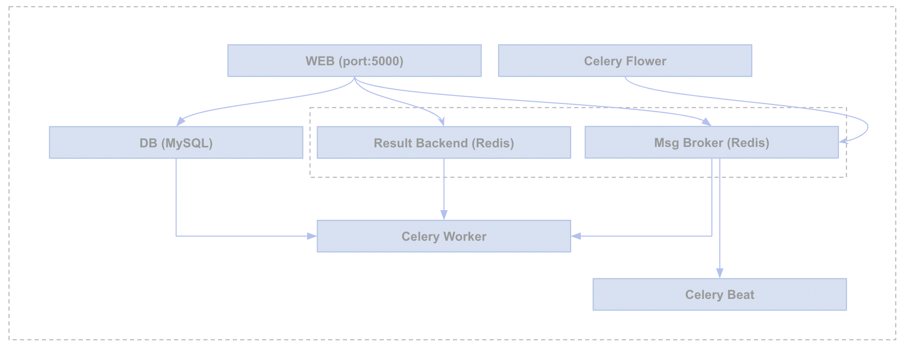

# Flask API Base

A feature-rich boilerplate for building RESTful APIs using Flask. This project provides a solid foundation with a modular structure, ready for extension and customization.

## Architecture



## Features

- **Authentication**: JWT-based token authentication.
- **Async Tasks**: Celery with Redis for background task processing.
- **Database**: Flask-SQLAlchemy and Flask-Migrate for database operations.
- **File Storage**: S3 integration for file uploads.
- **Email**: Flask-Mail integration, with MailHog for local development.
- **Containerization**: Fully containerized with Docker and Docker Compose.
- **API Documentation**: Swagger UI for interactive API documentation.
- **Configuration**: Environment-based configuration management.

## Project Structure

```
flask-api-base/
├── app/                  # Main application module
│   ├── api/              # API blueprints and routes
│   ├── models/           # SQLAlchemy models
│   ├── services/         # Business logic
│   ├── support/          # Helper modules (auth, S3, etc.)
│   └── workers/          # Celery worker definitions
├── compose/              # Docker-compose configurations
├── migrations/           # Database migration scripts
├── tests/                # Test suite
└── ...
```

## Getting Started

### Prerequisites

- [Docker](https://www.docker.com/products/docker-desktop) installed on your local machine.

### Setup

1.  **Clone the repository:**
    ```bash
    git clone <repository-url>
    cd flask-api-base
    ```

2.  **Environment Variables:**
    Create a `.env` file in the `.envdir` directory by copying the example.
    ```bash
    cp .env.example .envdir/.env
    ```
    Update `.envdir/.env` with your specific configurations (e.g., AWS credentials, secret key).

### Running the Application

1.  **Build and start the services:**
    ```bash
    docker-compose build
    docker-compose up
    ```

2.  **Access the application:**
    Once the containers are running, the following services will be available:
    - **API**: `http://localhost/api`
    - **Swagger Docs**: `http://localhost/api/docs`
    - **MailHog**: `http://localhost:8025`
    - **Flower (Celery Monitor)**: `http://localhost:5557`

3.  **Stopping the application:**
    To stop the running containers, press `Ctrl+C` in the terminal where `docker-compose up` is running.

## Database Migrations

To apply database migrations, first shell into the `web` container:
```bash
docker-compose exec web /bin/bash
```
Then, run the migration commands:
```bash
flask db migrate -m "Initial migration"
flask db upgrade
```

## Seeding Data

The project includes a seeder to populate the database with initial data.
```bash
docker-compose exec web /bin/bash
flask seed run
```


<h2>Configurations</h2>

* Application configs are stored at this location 
* * `.envdir\.env`
* updated the `GUNICORN_CMD_ARGS="--bind 0.0.0.0:8080 --workers=2 --threads=4 --worker-class=gthread --worker-tmp-dir /dev/shm"` for CMD line in Docker file.


<h2>Pipeline Setup<h2>


<h2>Docker Setup</h2>

* Install Docker Desktop
* Navigate to the root of the directory in terminal. You should be at the same level as the `docker-compose.yml` file.
* Run `docker-compose build`
* The step above will take around 5-10 minutes for the first time as the images get downloaded. Subsequent executions will be faster. 
* If the above step runs to its end successfully, run `docker image ls`. You should see below 5 images
* * `flask_api_base_celery_worker`
* * `flask_api_base_webapp`
* * `flask_api_base_celery_flower`
* * `flask_api_base_celery_beat`
* * `redis`
* Run `docker-compose up`
* If the above runs successfully, the applcation can be browsed at `http://127.0.0.1:5010/auth/login`
* If you wish to stop the container, press `ctrl+c` in the terminal 